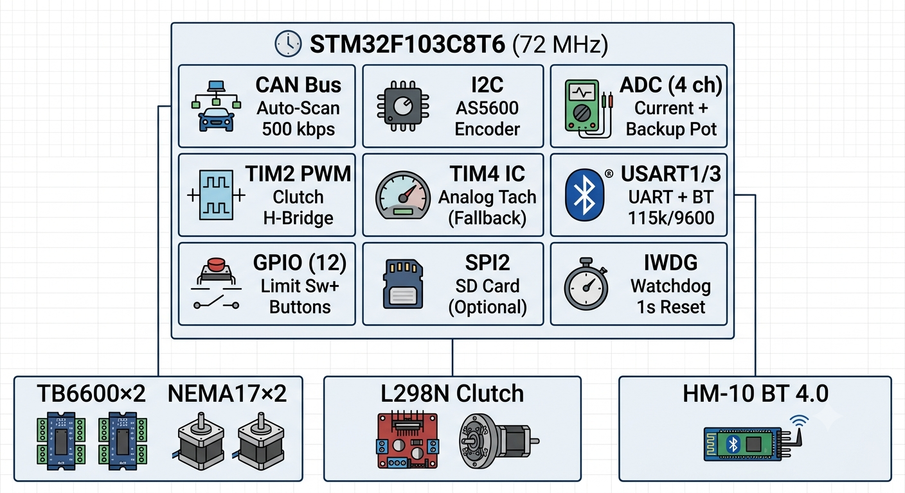
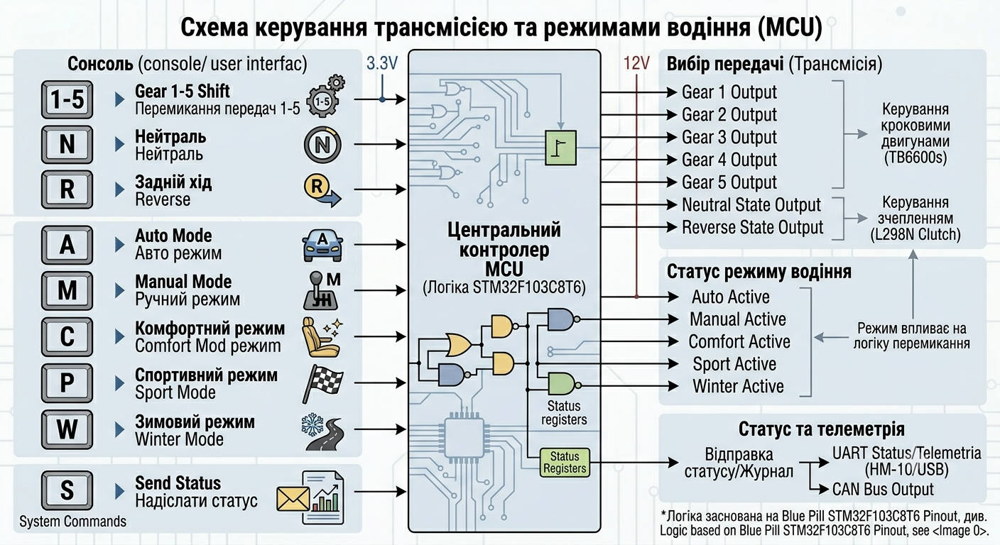

# 🚗 Adaptive Robotized Manual Transmission Controller
Chat: https://t.me/+YBdTQeCleQdkMmEy
# robotized-gearbox-controller-for-STM32
Adaptive Robotized Manual Transmission Controller for STM32
This commit adds the complete firmware for the Adaptive Robotized Manual Transmission Controller (STM32F103C8T6).

## 📊 System Architecture

STM32F103C8T6 at the center with all peripherals and external components

## 🌟 Project Overview
This open-source controller transforms a standard manual transmission into a fully automated robotized gearbox (AMT). Using two stepper motors for gear selection and a DC actuator for clutch control, the system reads vehicle data via CAN bus and performs automatic or manual gear changes with professional-grade safety features.
 Key Features
-🎯Automatic CAN Bus Profiling – Detects Ford, VW, Toyota, or BMW in 4 seconds without reprogramming
-⚡ Adaptive Shift Algorithm – Rev-matching emulation via adaptive clutch hold time
-🛡️ Dual Redundant Sensors – AS5600 magnetic encoder + analog potentiometer with automatic failover

 Intelligent Limp Mode – Safe operation during sensor/CAN failures with smartphone alerts
-📱 Bluetooth Control – HM-10 module for smartphone commands
-💾 Persistent Storage – Flash + SD card backup for calibration data
-🔋 Power Saving – Automatic sleep mode after 5s inactivity
-🅿️ Auto-Parking – Intelligent parking with clutch disengagement

## 🏗️ High-Level System Overview

Complete vehicle control system with MCU as central controller

📄 gearbox_controller.c (v1.3 - Optimized Production Build)
   Compact, optimized version for flashing to the MCU
   All known issues resolved (USART3 remapped to PC10/PC11, no pin conflicts)
   Analog tachometer implemented (TIM4, PB6)
   Stack-safe buffers (UART_MSG_BUF_SIZE = 64)
   Flash address range check added
   ~38 KB Flash usage (59% of 64 KB)

📄 gearbox_contr_coment.c (v2.0 - Ultimate Documented Edition)
   Fully commented version for competition submission and educational use
   Every function and critical line explained in English
   Ideal for Hackaday Prize, MDPI Electronics paper, and code review
   Same functionality as v1.3, just with extensive documentation

 Key Features Implemented:
   Automatic CAN bus profiling (Ford, VW, Toyota, BMW)
   Adaptive clutch control with rev-matching emulation
   Dual redundant clutch sensors (AS5600 + potentiometer)
   Intelligent Limp Mode with Bluetooth alerts
   4 drive modes: Comfort, Normal, Sport, Winter
   Auto-parking mode with clutch disengagement
   AWD control module (2WD/AUTO/LOCK/LOW)
   Current monitoring, watchdog, error logging
   Power saving sleep mode

📋 Hardware: STM32F103C8T6, TB6600 × 2, NEMA17 × 2, L298N, AS5600, SN65HVD230, HM-10
💰 Total BOM cost: ~$130-180 USD
📄 License: GPL-3.0

📜 Disclaimer – USE AT YOUR OWN RISK
This project (hardware design, firmware source code, wiring diagrams, documentation, and any associated materials) is provided for educational, research, and hobbyist purposes only. It is not a certified or production‑ready automotive component.
No Warranty: The software and hardware designs are provided “AS IS”, without any warranty of any kind, either express or implied, including but not limited to merchantability, fitness for a particular purpose, or non‑infringement. The entire risk arising out of use or performance of the system remains with you.
No Liability: In no event shall the authors, contributors, or copyright holders be liable for any claim, damages (including, without limitation, direct, indirect, incidental, special, consequential, or exemplary damages), or other liability arising from the use, installation, modification, or misuse of this system, even if advised of the possibility of such damages.
Automotive Safety Warning: Controlling a vehicle’s transmission and clutch involves inherent risks, including but not limited to unexpected vehicle movement, loss of control, mechanical damage, transmission damage, clutch damage, engine damage, personal injury, or death. The system has not been tested for compliance with automotive safety standards (e.g., ISO 26262, ASIL, or any other functional safety standard). You are solely responsible for ensuring that any installation is performed by a qualified professional, that all applicable laws and regulations are followed, and that the vehicle remains safe to operate.
Simulation vs. Reality: All simulation results (including those obtained from Wokwi or any other simulator) are not a substitute for real‑world testing. The software may behave differently in a real vehicle due to electromagnetic interference, mechanical tolerances, wiring quality, power supply variations, and many other factors. You are fully responsible for conducting thorough testing on a closed track or under controlled conditions before using the system on public roads.
Modifications and Maintenance: Any modification of the source code, electrical connections, or mechanical parts voids this disclaimer and is done entirely at your own risk. You are responsible for regular inspection and maintenance of the entire system.
Intended Use: This project is not intended for use in any commercial product, medical device, life support system, or any application where failure could lead to injury, death, or severe property damage. If you choose to use this system in a vehicle operated on public roads, you assume all legal and financial responsibility.
By using, copying, or modifying any part of this project, you acknowledge that you have read and understood this disclaimer and agree to be bound by its terms.

## 💖 Support This Research
If you find this project useful for your studies, car tuning, or engineering work, please consider supporting my research. Your contributions help me buy hardware for new prototypes and keep this project open-source.

- **Direct Bank Transfer (IBAN):** UA183052990000026209884907769 (PrivatBank) - *Contact me for details *

**Goal:** Raise $10,000 to build a commercial-grade test bench and adapt this controller for 10 different car models. 100% of funds go to hardware and open-source development.
